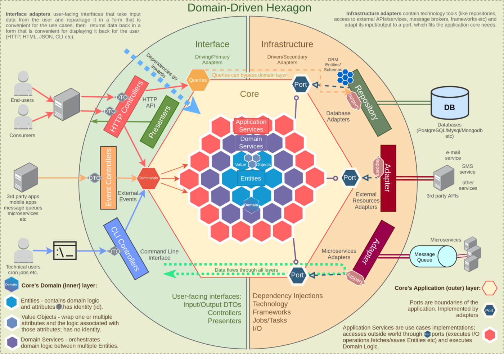
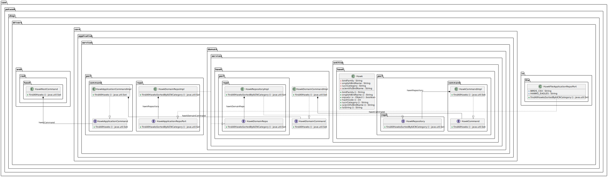

# Clean Architecture in Java Tutorial

+ 
+ 

https://herbertograca.com/2017/11/16/explicit-architecture-01-ddd-hexagonal-onion-clean-cqrs-how-i-put-it-all-together/

TODO: test coverage + arch unit test